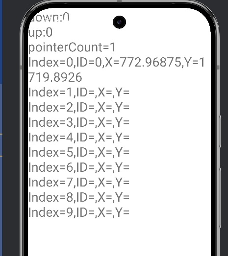

# Жесты и касания

## Поддерживаемые жесты

<u>Приложение обрабатывает следующие типы жестов:</u>

- **Одиночное касание** - базовое взаимодействие
- **Мультитач** - до 10 одновременных касаний
- **Масштабирование** - двумя пальцами
- **Перемещение** - drag жесты

## Код обработки жестов

```java
@Override
public boolean onTouch(View v, MotionEvent event) {
    int action = event.getActionMasked();
    int pointerCount = event.getPointerCount();
    
    switch (action) {
        case MotionEvent.ACTION_MOVE:
            if (isScaling && pointerCount == 2) {
                // Обработка масштабирования
                handleZoom(event);
            }
            break;
    }
    return true;
}
```

## Визуализация касаний

[](-)

## Настройки чувствительности

<u>Параметры кастомизации:</u>

- **Чувствительность масштабирования**
- **Минимальное/максимальное расстояние**
- **Скорость отклика**

[ Графика](../features/graphics.md) | [ API справка](../api/reference.md)