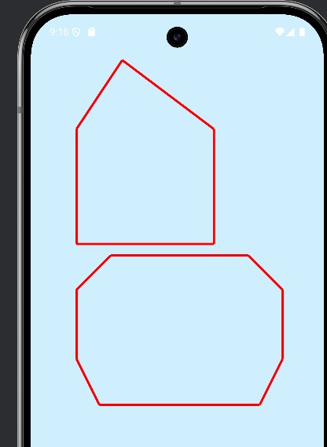

# Графические возможности

## Поддерживаемые фигуры

<u>Приложение поддерживает рисование следующих фигур:</u>

1. **Пятиугольники** - правильные и произвольные
2. **Шестиугольники** - с возможностью масштабирования
3. **Составные фигуры** - из линий и точек

## Масштабирование и трансформации

[ См. также API справку](../api/reference.md)

## Настройка отображения

<u>Доступные параметры рисования:</u>

- **Толщина линий** (1-20px)
- **Цвет фигур** (RGB палитра)
- **Стиль заливки** (FILL/STROKE)
- **Прозрачность** (alpha-канал)

[Использование](../guide/usage.md) | [ К содержанию](../README.md)